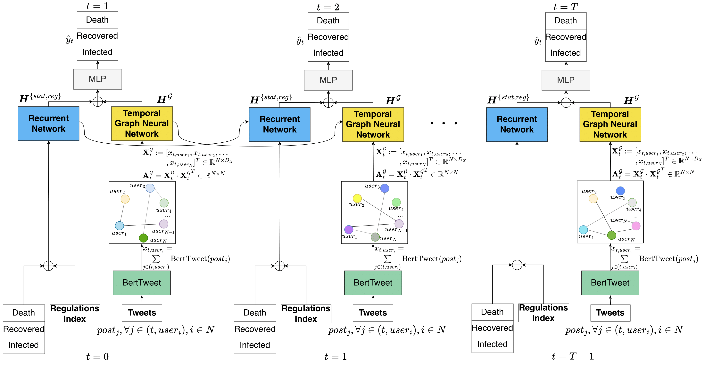

# MGLEP: Multimodal Graph Learning for Modeling Emerging Pandemics with Big Data

This repository includes the code for our papers, titled *SoBigDemicSys: A Social Media based Monitoring System for Emerging Pandemics with Big Data* (BigDataService 2022), and *Multimodal Graph Learning for Modeling Emerging Pandemics with Big Data*. Link: https://arxiv.org/abs/2310.14549.

> Accurate forecasting and analysis of emerging pandemics play a crucial role in effective public health management and decision-making. Traditional approaches primarily rely on epidemiological data, overlooking other valuable sources of information that could act as sensors or indicators of pandemic patterns. In this paper, we propose a novel framework called MGLEP that integrates temporal graph neural networks and multi-modal data for learning and forecasting. We incorporate big data sources, including social media content, by utilizing specific pre-trained language models and discovering the underlying graph structure among users. This integration provides rich indicators of pandemic dynamics through learning with temporal graph neural networks. Extensive experiments demonstrate the effectiveness of our framework in pandemic forecasting and analysis, outperforming traditional methods, across different areas, pandemic situations, and prediction horizons. The fusion of temporal graph learning and multi-modal data enables a comprehensive understanding of the pandemic landscape with less time lag, cheap cost, and more potential information indicators.

### MGLEP Framework Architecture



## Repository Structure

* *data*: the multimodal data, includes the processed and generated graph-structured data from social media data

* *lib*: contains self-defined modules for our work, such as data loading, data pre-process, normalization, and evaluate metrics.

* *model*: implementation of our MGLEP framework and other baseline models


## Reproduce

Python >= 3.6.
```
pip install -r requirements.txt
```

Our models implementation is in folder *model*. To replicate the results, you can prepare the data and run *model/Run.py* (for our model and other deep learning-based) or *model/Run_stat.py* (for statistical and machine learning models).

An example is given in the script *model/run.sh*.

## Reference

These main sources of data are leveraged:
* [The COVID-19 statistics from Johns Hopkins University Center for Systems Science and Engineering](https://github.com/CSSEGISandData/COVID-19).
* [The COVID-19 Government Responses and Regulations Data from The Oxford Covid-19 Government Response Tracker (OxCGRT)](https://github.com/OxCGRT/covid-policy-dataset).
* The social media data are crawled from Twitter social media platform by tweets related to COVID-19 released by [Covid-19 Twitter chatter dataset for scientific use](https://github.com/thepanacealab/COVID19_twitter).

This project is based on the implementation from https://github.com/LeiBAI/AGCRN.
